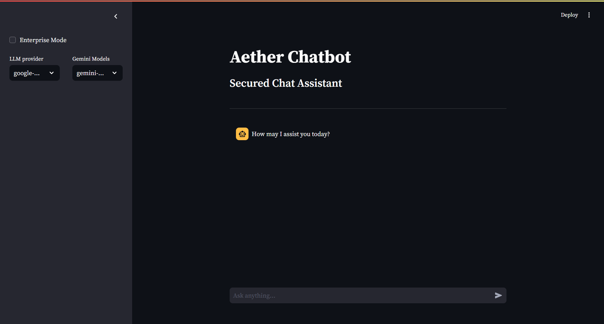

# The Aether Gateway on Streamlit

This example shows off the abilities of the Aether gateway and engine through a [Streamlit](https://streamlit.io/generative-ai) UI, making use of Aether effortless. In this example, we will create a simple Streamlit interface that allows us three key options:

1. Running in *Enterprise Mode*: running the agent in *Enterprise Mode* subjects its LLM calls and the LLM's responses to the policies configured through Aether, and enables all Aether governance and logging.
2. The LLM Provider: currently, the choices `google-generativeai` (Gemini) and `azure-openai` (Azure OpenAI) are supported.
3. The LLM model name: for Gemini only. For Azure Openai, please see the section on environment variables below.



## Setup

To set up an environment for this example, follow these steps.

1. Clone this repo.

    - HTTPS
        ```bash
        git clone https://github.com/invisibl-genai/aether-cookbook.git
        ```
    - SSH
        ```bash
        git clone git@github.com:invisibl-genai/aether-cookbook.git
        ```

2. Switch to the `serviceproxy/gateway_on_streamlit/` directory.

    ```bash
    cd serviceproxy/gateway_on_streamlit/
    ```

3. (Optional:) Set up a [virtual environment](https://packaging.python.org/en/latest/guides/installing-using-pip-and-virtual-environments/).

    ```bash
    python3 -m venv .venv
    ```
    
    Once this is done, activate the environment.
    - On Posix systems
        ```bash
        source .venv/bin/activate
        ```
    - On Windows systems
        ```powershell
        .venv\Scripts\activate
        ```
    
    *N.B.*: To deactivate the virtual environment when you're done, simply run `deactivate`, regardless of your operating system.

4. Install the requirements for the example.

    ```bash
    python3 -m pip install -r requirements.txt
    ```

5. Set up the required environment variables. We recommend storing these in a `.env` file within this folder. The contents of that file will look like this. (The example will automatically take note of any `.env` file within this folder and load its contents into the environment variables.)

    ```bash
    # To run with Enterprise Mode
    AETHER_API_KEY="your-aether-api-key"
    AETHER_PROXY_ENDPOINT="your-aether-proxy-endpoint"
    # To run Azure without Enterprise Mode
    AZURE_API_KEY="your-azure-openai-api-key"
    AZURE_ENDPOINT="your-azure-openai-endpoint"
    AZURE_PROVIDER_MODEL="your-azure-openai-deployment-name"
    # To run Gemini without Enterprise Mode
    GOOGLE_API_KEY="your-google-api-key"
    ```

6. Finally, run the example script.

    ```bash
    streamlit run run.py
    ```
